# Next Step

> The West Coast of the United States, and Seattle in particular, has a huge homeless population. Many organizations may be willing to aid and employ homeless people, but there isn't always an easy way to streamline the connection between managers and potential employees. Next Step is an application that helps connect the homeless population looking for employment with managers who need help.

## Table of Contents

* [Description](#description)
* [Usage](#usage)
* [Collaborators](#collaborators)
* [Questions](#questions)

## Description

Although there are several job posting applications available online, many of them are out of reach for those who experience homelessness. Next Step allows the homeless population to browse through a list of jobs, as well as contact the jobs' managers through an e-mail to express their interest. The application also allows managers to create an account, where they can update their profile information, post and update jobs, and view the listings they have posted. Next Step uses Sequelize and MySQL, Node Express, Express Sessions, Express Handlebars, Bcrypt, Nodemailer, the Bulma CSS framework, and FontAwesome icons to ensure its functionality. The layout is also mobile responsive to ensure that users accessing this app through tablets or smartphones will have the same user experience as those using the desktop application.

You can access Next Step at https://next-step-employment-app.herokuapp.com/. 

## Usage

When you open Next Step's homepage, you have three choices: view jobs, log in, or sign up. 

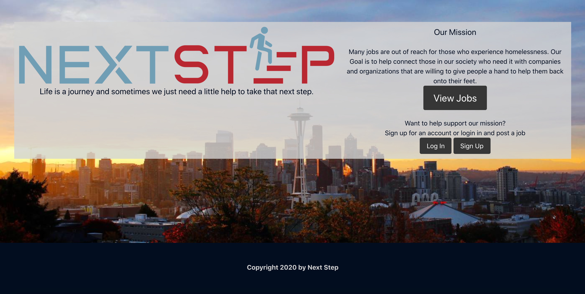

If you are a potential employee seeking jobs, you can click "View Jobs" to see the list of jobs that have been posted on Next Step. You can use the dropdown on top of the page to sort the jobs by post date, wage, or whether they're full-time or part-time positions. 

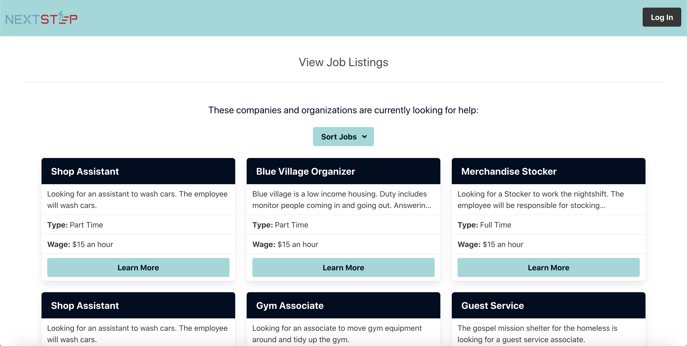

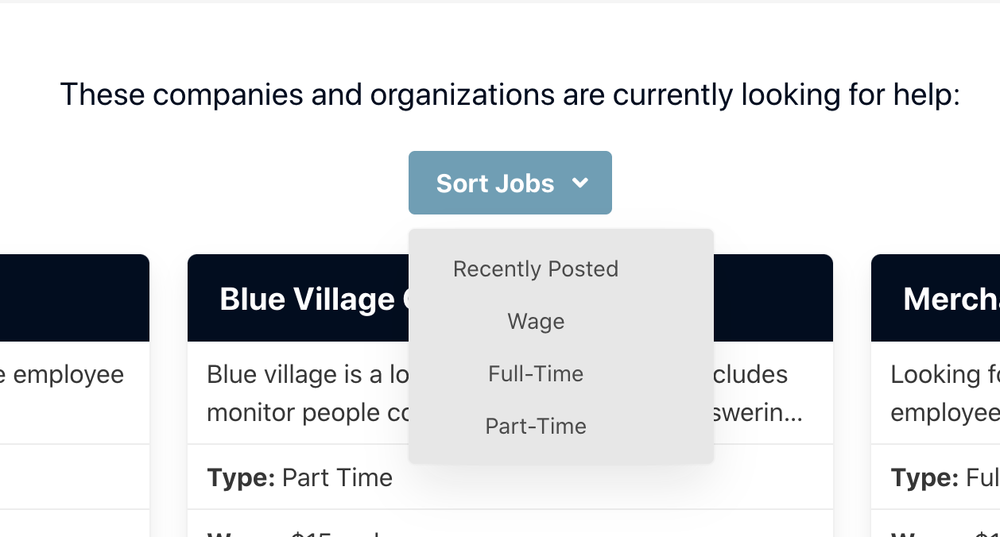

If users are interested in a job, they can click on "Learn More" and be brought to the Job Details page. This page shows more information about the posted job and company involved, as well as an option to contact the position's manager or return to the job listings page.

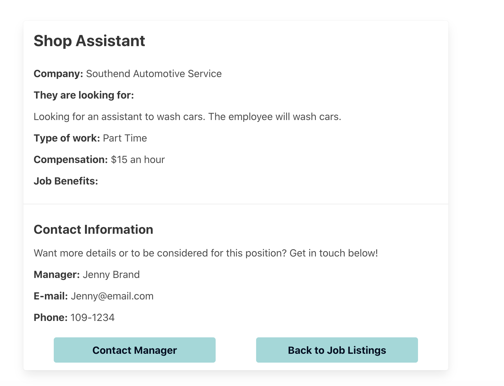

When the "Contact Manager" button is clicked, a form will pop up where the user can input their name, e-mail address, and any other relevant information that they wish to send the employer. The user can click the "Submit" button when they're finished entering their information, and Next Step uses Nodemailer to contact the employer who posted the job and let them know the user is interested! Once their message is sent, Next Step will notify that it was sent successfully and they are free to close the window and keep browsing jobs.

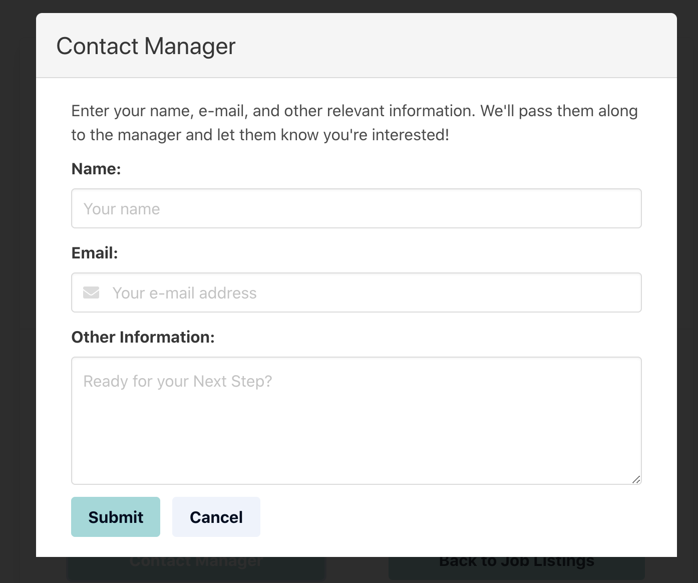

Next Step also has functionality for managers: from the homepage, managers can either log in to a pre-existing account, or sign up for a new account. 

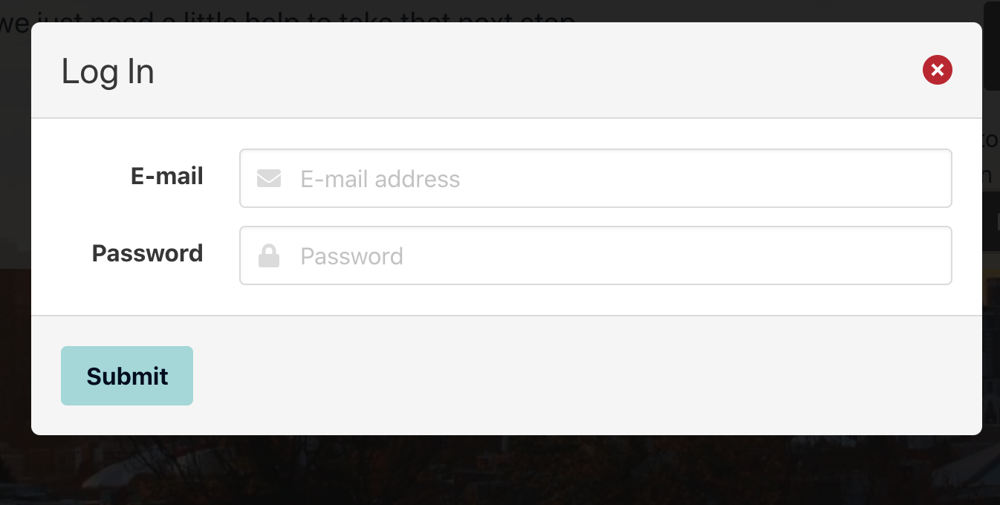

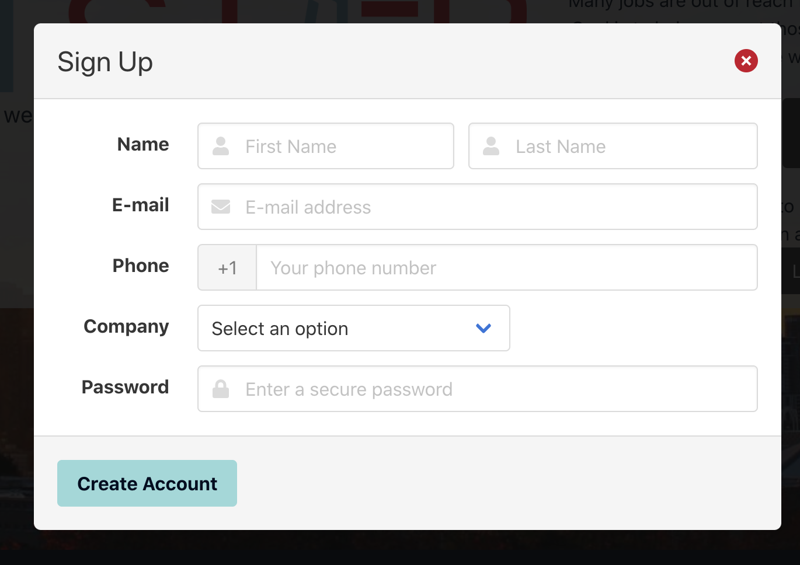

When signing up, managers have the option to use a company that has already been used on the site, or to create a new company if their company doesn't exist within the list of options.

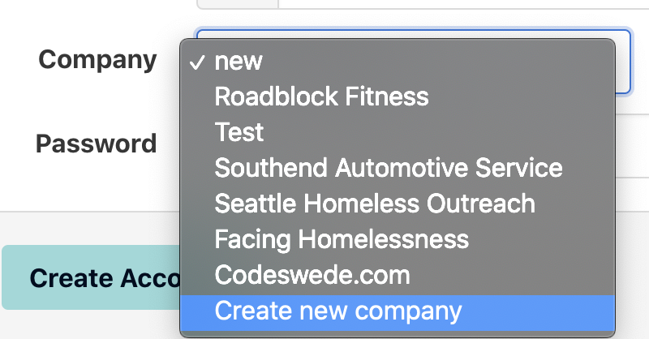

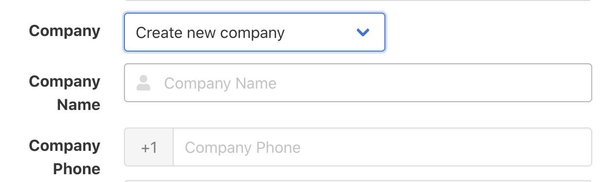

Once the manager logs in or creates their account, they are taken to their profile page, where they can view or edit their profile information such as their name, phone number, or biography.

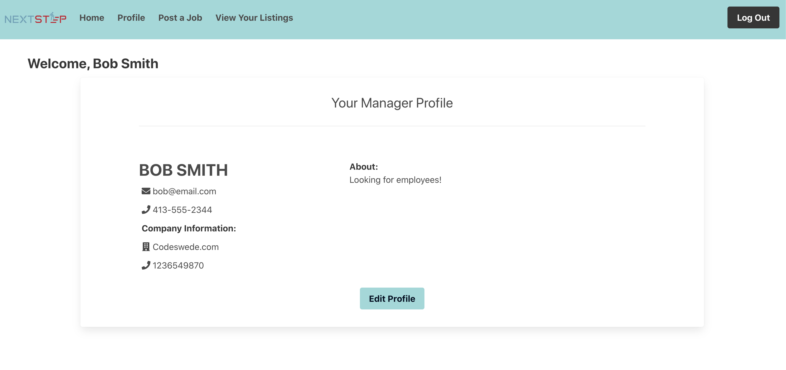

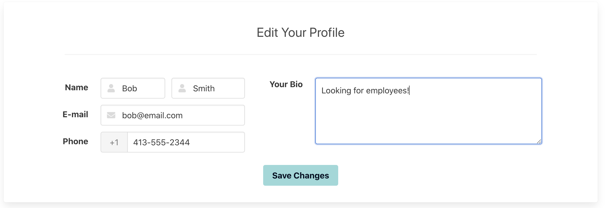

Managers can click on "Post a New Job" on the navbar in order to post a new job opening on Next Step. When posting a job, managers should include a job title, a job description, the contact phone for this position, whether it is full-time or part-time, the hourly wage, and which benefits the job includes. Once they click "submit", the job will be posted to Next Step!

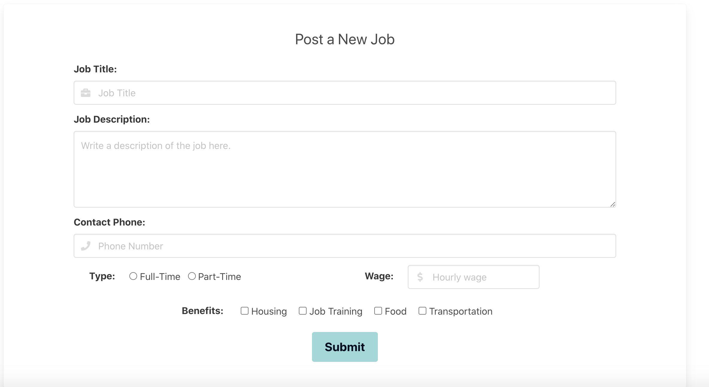

Finally, if managers click "View Your Listings" on the navbar, they will be taken to the jobs that they have recently posted. There, they can edit or delete the jobs they have already posted.

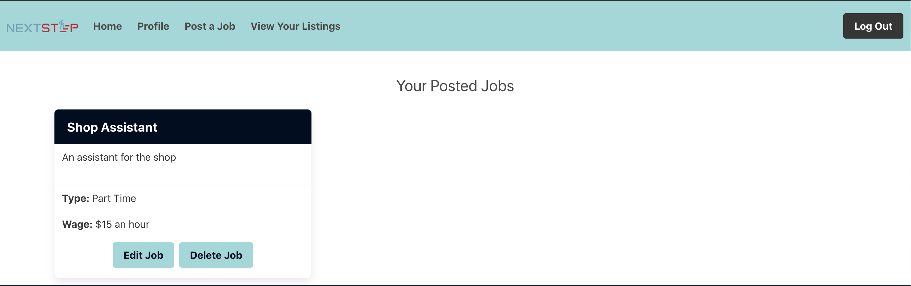

## Collaborators

The Next Step Team:

Mike Fallesen: [GitHub Profile](https://github.com/mfallesen)

Hao Guan: [GitHub Profile](https://github.com/devtown425)

Brandon Phillips: [GitHub Profile](https://github.com/BrandonP321)

Maria Waslick: [GitHub Profile](https://github.com/mwaslick)

## Questions

If you have additional questions, you can contact any of the team members through their GitHub profiles, or e-mail me at mariawaslick@gmail.com.